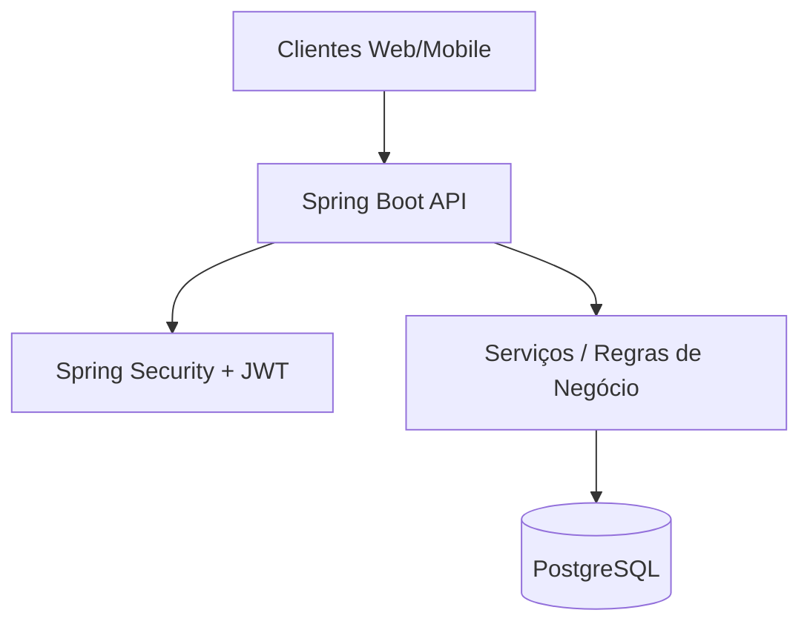

# 🛍️ Sistema de Gestão de Vendas - API Backend

## 🚀 Sobre o Projeto
Backend do **sistema de gestão de vendas**, desenvolvido com **Spring Boot**.  
Expõe uma **API RESTful** segura e escalável para operações de um Ponto de Venda:  
controle de estoque, registro de vendas e autenticação de usuários.

---

## 🏗️ Arquitetura



---

## ⚙️ Como Rodar

### ✅ Pré-requisitos
- JDK 21  
- PostgreSQL 14+  
- Maven 3.8+  
- IDE (IntelliJ recomendada)

### 🔧 Passos
```bash
git clone https://github.com/KelvynAmaral/pdv-mercearia-Spring.git
cd pdv-api
```

Crie o banco `pdv_mercearia` no PostgreSQL.  
Edite `src/main/resources/application.properties`:

```properties
spring.datasource.password=SUA_SENHA_DO_POSTGRES
```

Rode a aplicação (`PdvApiApplication.java`).  
Servidor inicia em **http://localhost:8080**.

---

## ▶️ Testando a API

### 1. Registrar Usuário
```http
POST /auth/registrar
```
```json
{
  "email": "admin@pdv.com",
  "senha": "senha123",
  "role": "ROLE_ADMIN"
}
```

### 2. Login
```http
POST /auth/login
```
Resposta: token JWT.

### 3. Criar Produto
```http
POST /produtos
Authorization: Bearer SEU_TOKEN
```
```json
{
  "codigo": "001",
  "nome": "Arroz 1kg",
  "precoVenda": 5.50,
  "quantidadeEstoque": 100
}
```

---
